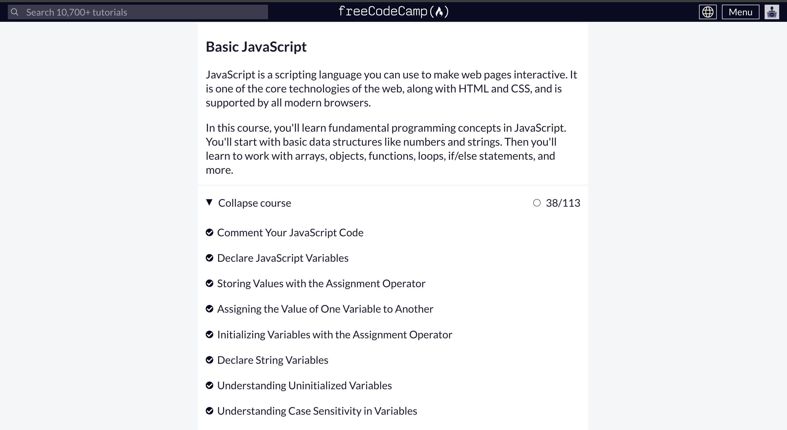

# Day 10: JavaScript, Console, Variables, Types, Debugging

  ## Task
  - Create a variable to store the Address Book data, such as contacts, since Address Book is the application name.
    - The contacts data would be organized as array of objects
    - The contact have several fields such as ID, Full Name, Phone, Email, Location, etc.
    - Console log the data.

    You could check the work on [this file](https://github.com/navi-0115/bearmentor-logbook-navi/blob/main/month-2/day-10/day-10.js)
    
    ## Results
    
    

    ## Learn
    I practice basic javascript through **[freecodecamp](https://www.freecodecamp.org/learn/javascript-algorithms-and-data-structures/) ** to enhance understandings of javascript programming
    
